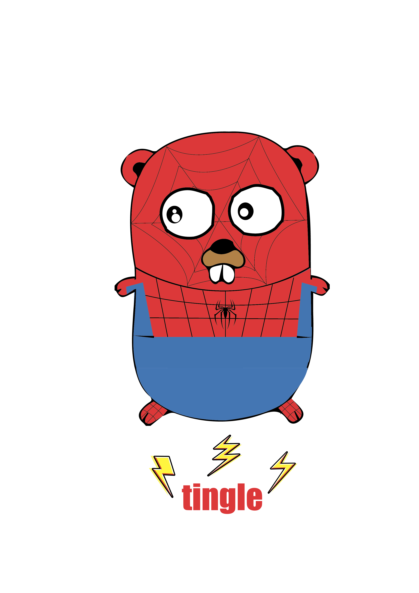

# Tingle
A Lightweight Go Framework. `Skr Tingle` 😜 Just for us, Maybe for you.


> Is Developing. Pls Wait.

```
.
├── LICENSE
├── README.md
├── app.go
├── context.go
├── exmaple
│   └── demo.go
├── logger.go
├── logo.png
├── middleware.go
└── router.go
```

## Feature

- [x] Better request middleware, Implement by the pattern "Chain Of Responsibility".
- [x] Support before startup middleware for each API, where your can define some async task, such as make the API cache.
- [ ] More easily router algorithm.
- [ ] More few code.
- [ ] Use epoll.

## Contribution

- Branch Name must be the format `feature/{{yourbranchname}}`, such as `feature/router`
- Commit msg Must be the format `{{type}}({{path}}): {{desc}}`, such as `feat(app): support BeforeStartupHandler `

```
feat:     A new feature
fix:      A bug fix
docs:     Documentation only changes
style:    Changes that do not affect the meaning of the code (white-space, formatting, missing semi-colons, etc)
refactor: A code change that neither fixes a bug or adds a feature
perf:     A code change that improves performance
test:     Adding missing tests
chore:    Changes to the build process or auxiliary tools and libraries such as documentation generation
```